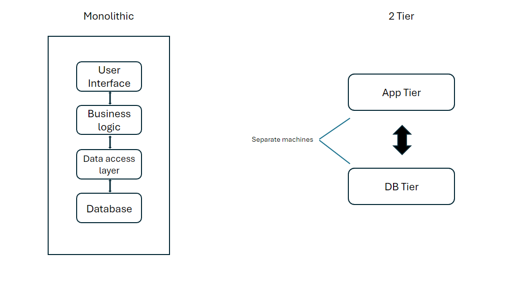

# <ins> Monolithic app vs 2 Tier app

## <ins>Monolithic:
#### All dependencies are in one server from the user interface to the database.
### Pros:
- #### Simplicity: 
  - Monolithic architectures are generally simpler to develop, deploy, and manage. Since the entire application is contained within a single codebase, it's easier to understand and reason about the system as a whole.
- #### Performance: 
  - Monolithic applications often have lower latency because they involve fewer network hops compared to distributed systems. In-memory function calls within the same process are faster than inter-process communication.
- #### Easier Development: 
  - In a monolithic architecture, developers have access to the entire codebase, making it easier to navigate and make changes. This can facilitate faster development and debugging.
### Cons:
- #### Scalability: 
  - Monolithic architectures can be challenging to scale horizontally because all components are tightly coupled. Scaling requires replicating the entire application stack, even if only a specific component requires additional resources.
- #### Maintenance Challenges: 
  - As monolithic applications grow larger, they can become more challenging to maintain and extend. Changes to one part of the application can have unintended consequences on other parts, leading to potential regressions.
- #### Technology Lock-in: 
  - Monolithic architectures can lead to technology lock-in since all components are tightly coupled. It can be difficult to adopt new technologies or update existing ones without significant refactoring.
## <ins> 2 Tier:
#### Split the deployment into seperate instances. App has its own instance/tier and database has its own instance/tier
### Pros:
- #### Scalability: 
  - Two-tier architectures are more scalable than monolithic architectures because they allow for more granular scaling. For example, you can scale the server tier independently of the client tier based on demand.
- #### Flexibility: 
  - Two-tier architectures offer greater flexibility in terms of technology choices and updates. You can update or replace individual components in the server tier without impacting the client tier, allowing for easier adoption of new technologies.
- #### Separation of Concerns: 
  - Two-tier architectures enforce a clear separation of concerns between the client and server tiers, making the system easier to understand, develop, and maintain. Changes to one tier are less likely to impact the other tier.
### Cons:
- #### Complexity: 
  - Two-tier architectures can introduce additional complexity, especially in distributed systems where communication between the client and server tiers needs to be managed effectively. This complexity can lead to challenges in development and debugging.
- #### Network Overhead: 
  - Two-tier architectures involve communication over a network, which can introduce network latency and overhead. Performance can be impacted by factors such as network congestion and latency.
- #### Security Concerns: 
  - Distributing the application across multiple tiers introduces additional security concerns, such as securing communication between the client and server tiers and protecting sensitive data transmitted over the network.