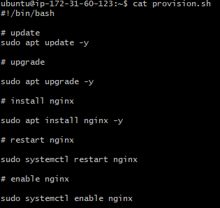

- [Basic Commands](#basic-commands)
    - [File / directory commands](#file--directory-commands)
    - [Example](#example)
      - [Create a chicken joke](#create-a-chicken-joke)
      - [Write out a basic chicken joke on 3 lines then press ***ctrl + x*** to exit and then ***y*** to save then ***enter*** to save file name](#write-out-a-basic-chicken-joke-on-3-lines-then-press-ctrl--x-to-exit-and-then-y-to-save-then-enter-to-save-file-name)
    - [`chmod` change permissions](#chmod-change-permissions)
    - [Scripts](#scripts)
    - [Variables](#variables)
    - [Processes](#processes)
      - [parent process and child process](#parent-process-and-child-process)


# Basic Commands

- `uname` = What is current OS
- `"command" --help` = Options for most commands
- `whoami` = Current user
- `sudo` Is super user do (permissions)
- `sudo su` Logs in as super-user
- `sudo apt update -y` Downloads latest packages
- `sudo apt upgrade -y` Installs latest packages that have been downloaded
- `sudo apt install "package" -y` Installs a specific downloaded package
- `snap install tree` Installs a module called tree that can visually show you your directories and files. `snap` downloads and installs packages in one step.

### File / directory commands
- `curl` = Download stuff online. Can download files.
- `file` = Checks file type
- `mv` = Move / rename
- `cp` = Copy
- `rm` = Remove file. Add `-r` for directory removal.
- `mkdir` = Make directory
- `touch` = Create file
- `cat` = Display contents of file
- `nano` = Basic text editor
- `cd` Changes directory. `cd` by itself goes home directory add `..` to move up a directory use `/` to go to root directory or specify any other path / directory
- `pwd` Is current directory


### Example 

#### Create a chicken joke

1. `touch chicken-joke.txt`

Then

2. `nano chicken-joke.txt`
#### Write out a basic chicken joke on 3 lines then press ***ctrl + x*** to exit and then ***y*** to save then ***enter*** to save file name


1. To print the top 2 lines of `chicken-joke.txt` to the screen:
```bash
head -2 chicken_joke.txt
```

2. To print the bottom 2 lines of `chicken-joke.txt` to the screen:
```bash
tail -2 chicken_joke.txt
```

3. To number the lines of `chicken-joke.txt` when outputting the file to the screen:
```bash
cat -n chicken_joke.txt
```

4. To print only the lines of `chicken-joke.txt` which contain the keyword "chicken":
```bash
grep "chicken" chicken_joke.txt
```

### `chmod` change permissions

| user | group | everyone | : | read | write | execute |

read is 4 write is 2 execute is 1 nothing is 0

If we want user rwx group rw and everyone r

chmod 4+2+1, 4+2, 4

`chmod 764`

### Scripts

`#!` - used to start scripts - shebang

`!#/bin/bash` choose bash shell to run script

Can create a file using `nano` that starts with `!#` then add lines of script after.



### Variables

can create varibales in normal way `variable = variable_value`

call them using `$variable`

`printenv` prints environment variables

`export` can export variable to env variables

to make it stay everytime (persistence)

`nano .bashrc`

add `export variablename_variablevalue` to the bottom

exit and then 

`source .bashrc`

### Processes

```
ps #shows processes
ps - aux #shows all processes
top #shows currently running processes with times
~ within top can sort using shift m for memory shift p for processor and shift n for newest~
```


#### parent process and child process

if you kill parent child will remain as a zombie process

kill using `kill` command

exit processes with c or ctrl c or ctrl q
