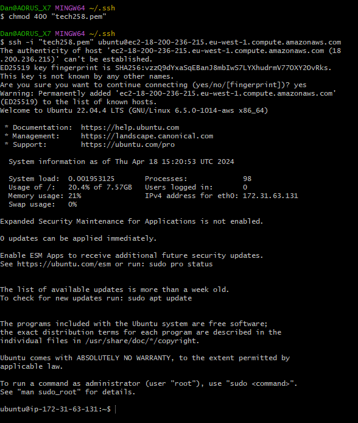

# How to launch AWS EC2 instance and install nginx
### 1. Navigate to AWS and use search bar to search EC2

### 2. Click launch instance

### 3. Give appropriate name

### 4. Choose AMI

AMI is an Amazon Machine Image. It is a snapshot of a configuration. It includes what OS to use as wel as any files, applications and config set-ups that may be on there. We can create our own but for now we are using the standard free plain Ubuntu image.
### 5. Choose instance type

Choose what system requirements you want on your VM. How many virtual CPUs and how much memory. Different options available for different applications. In our case we are using a free tier that is small because we don't need it for anything intensive, and we want to keep costs down. No wastage. 
### 6. Choose/Create key pair for login

Create or choose an already created key pair that you want to use for the system to login. It will apply the public key to the server and require us to have the private key in order to access it. The private key unlocks the public key and grants us access to the resource. <br> In our case we are using the tech258 key that has already been created with our private key saved in our .ssh folder
### 7. Configure security group

Choose your security group or create a new one. In our case we are going to create one and allow ssh from anywhere and http from anywhere. We then need to click ***Edit*** in the top right to choose an appropriate name. Once you click create make sure it's in the right virtual network and subnet then scroll down to name.


Choose an appropriate name and description and ensure you had ssh allowed from anywhere and http allowed from anywhere (0.0.0.0/0). Scroll down to next step once done

### 8. Configure Storage


Choose the amount of storage you would like attached to the server (his storage will be tied to the server so if the server gets shut down, so does the storage). <br> In our case we are using the default amount we don't need much.

### 9. Launch the instance and connect to it

Review what you have done and click launch. 
#### NOTE: 
You can add whatever you want the system to run in user data, so we could install nginx this way or even run scripts we have made, but for this purpose we are going to launch, connect and do it manually.

### 10. Connect using bash

Click on your instance after launching it. Click connect (refresh if it's greyed out). 

Then click SSH client

Now open your bash terminal and go to where your private key is stored that we mentioned earlier. use `ls` to make sure your file is there

Now copy the codes from the previous image from the AWS console. For me this is :
```
chmod 400 "tech258.pem"
ssh -i "tech258.pem" ubuntu@ec2-18-200-236-215.eu-west-1.compute.amazonaws.com
```
This should connect us to the EC2 instance we just created. Type `yes` when prompted.



#### YOU ARE NOW CONNECTED FROM BASH TERMINAL!

### 11. install updates and nginx
Now we must download and install the latest ubuntu packages. Use the following lines of command individually:

```
sudo apt update -y
sudo apt upgrade -y
sudo apt install nginx -y
```
The first one downloads the packages. The second line then installs them. The third line installs our application nginx that we want running on the server. `-y` just confirms the code. it would ask us if we want to continue normally but adding this skips that step. Essentially answering yes for us already. Useful for scripting and removing the need for input.
#### NOTE:
The screen may go pink. Simply press enter when this happens and continue. (may have to do twice)


### 12. Ensure nginx is running

To ensure we have what we want running (nginx) we use the following command:
```
systemctl status nginx
```
We should see that it is running.


#### NGINX INSTALLED SUCCESSFULLY!

### 13. Connect and see your webserver
Navigate back to the AWS console and back to your instance. Copy the public IP address (or click open new window)

Open this in a new tab to see verify everything is working correctly.
<br> You should see something like this:


#### YOU HAVE NOW SUCCESSFULLY INSTALLED AND CONNECTED TO AN NGINX WEBSERVER HOSTED ON AN AWS EC2 INSTANCE!

#### If all other steps worked but you cant open in browser, check security group rules and ensure port 80 is open fot HTTP from anywhere (all IPs)


### What is nginx?

 Nginx is a high-performance, open-source web server software known for its efficiency and scalability. Originally developed to address the C10k problem (handling 10,000 concurrent connections). It's almost like a waiter at a restaurant.

Imagine you're running a restaurant, and you have a lot of customers coming in. You need someone to manage the flow of customers, directing them to tables, making sure everyone gets served efficiently, and handling any special requests.

Nginx is like the waiter of your website or web application. It's a type of software that sits between your users (the customers) and your website or web application (the kitchen). It helps manage the traffic coming to your site, making sure everyone gets served quickly and efficiently.


#### Here's how it works:

- #### Handling incoming requests:
    - When someone tries to access your website, their request goes to Nginx first. Nginx then decides where to send that request based on rules you've set up.

- #### Load balancing:
  - If you have multiple servers or "kitchens," Nginx can distribute incoming requests among them, making sure no one server gets overwhelmed.
- #### Caching:
  - Nginx can store copies of frequently accessed data, like images or web pages, so it can serve them faster without having to request them from your main server every time.
- #### Security:
  - Nginx can help protect your website from malicious attacks by filtering out suspicious requests and providing features like SSL encryption.
- #### Reverse proxy:
  - Nginx can act as an intermediary between your users and your web server, handling tasks like serving static files or compressing data before sending it to the user.

#### Overall, Nginx is a powerful tool for making sure your website runs smoothly, efficiently, and securely, even when you have a lot of traffic coming in.


