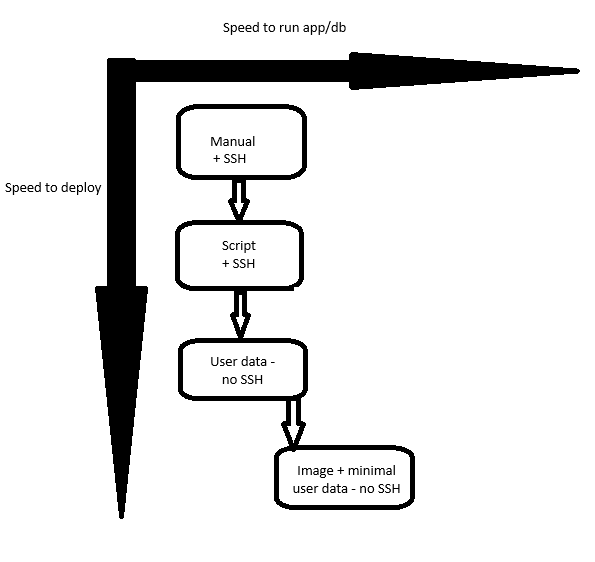
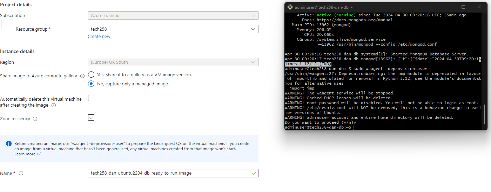

# 2 tier app deployment in azure

- [2 tier app deployment in azure](#2-tier-app-deployment-in-azure)
    - [1. Create virtual networks ](#1-create-virtual-networks-)
  - [2. Virtual Machine set up ](#2-virtual-machine-set-up-)
  - [3. Database VM ](#3-database-vm-)
  - [4. SSH into Vms ](#4-ssh-into-vms-)
  - [5. Check](#5-check)
  - [6. Difference between Azure and AWS](#6-difference-between-azure-and-aws)
  - [7. Using User Data](#7-using-user-data)
  - [8. Cleaning up resources](#8-cleaning-up-resources)
  - [9. Machine images](#9-machine-images)
      - [What is an Image](#what-is-an-image)
      - [What is not inlcuded](#what-is-not-inlcuded)
    - [How to set up custom image from a vm](#how-to-set-up-custom-image-from-a-vm)
        - [How I did it for the DB](#how-i-did-it-for-the-db)
        - [How I launched the app](#how-i-launched-the-app)
        - [Things to note](#things-to-note)
        - [Generalizing the VM](#generalizing-the-vm)
    - [Side effects of making a machine image on azure](#side-effects-of-making-a-machine-image-on-azure)
    - [User data needed when image is used](#user-data-needed-when-image-is-used)


### 1. Create virtual networks <br><br>
   1. Go to virtual networks and then ***"Create"*** on the left <br><br>

       <br><br>

   2. Subnet + Resource group and name <br><br>
    <br><br>
   click next and next again until you get to IP addressess<br><br>
    <br><br>
   3. click ***"Add a subnet"***<br><br>
   
      make two subnets:<br><br>
      1. First one: Subnet name: public-subnet, Address range: 10.0.2.0/24

        <br><br>

       Press add <br><br>

       2. Second one: Subnet name: private-subnet, Address range: 10.0.3.0/24 <br><br>

         <br><br>

        Press add<br><br>
    4. Add your tags  <br><br>

         <br><br>
    5. click ***"Review + create"***  and then ***"Create"*** <br><br>

## 2. Virtual Machine set up <br><br>
   1. App VM <br><br>

         go to virtual machines <br><br>
          <br><br>
         click create <br><br>
          <br><br>
    
         Our chosen parameters were given to us so follow if you want to use those (pictures) or choose your own. <br><br>
   
   2. Basics <br><br>

         sub + resource group and availability <br><br>
          <br><br>
         image and size :warning: choose standard for security type <br><br>  <br><br>
          <br><br>
         choose admin account name and key <br><br>
          <br><br>
         choose basic inbound ports (optional -can edit and create security group later) <br><br>
          <br><br>
         once done click next:Disks <br><br>
   3. Disks <br><br>
         choose disk size and click next: networking <br><br>
       <br><br>
   4. Networking <br><br>
      1. Choose your virtual network you created earlier and your **<ins> public subnet for the app and private subnet for the database**. In this instance you can allow it to create a new public ip. <br><br>
      2. Choose advanced for ***"NIC network security group"*** <br><br>

           <br><br>
      3. under ***"Configure network security group"*** click ***"Create new"*** <br><br>

            Add appropriate name and inbound rules <br><br>

           <br><br>

           Should end up with this <br><br>

            <br><br>

         Click ***"OK"*** <br><br>

         (optional) check the box that says delete public ip and NIC with vm so when its terminated we dont have that resource. We can keep it if we want to reuse it. This is diff from aws <br><br>

       5. Click ***"Review + create"*** and add the same tags as the virtual network. Then click ***"Create"*** <br><br> 

## 3. Database VM <br><br>

Follow the same steps except this time we only need port 22 open for ssh (see ***basics*** above) so dont need to create a nsg. One will be created for you. :warning: Remember to use the private IP for database vm in the script for the app VM! <br><br> :warning: ENSURE RIGHT DB IMAGE OR SCRIPT MAY NOT OPERATE <br><br>

## 4. SSH into Vms <br><br>

Once made we want to ssh into our VMs and run our scripts we made before. [DB SCRIPT](https://github.com/dahm641/tech258_cloud/blob/main/linux/app/db_script.sh) [APP SCRIPT](https://github.com/dahm641/tech258_cloud/blob/main/linux/app/app_script.sh) <br><br>
:warning: Run db script first on db vm then app script on app vm <br><br>

We can SSH by finding our vm and clicking ***"connect"*** <br><br>
 <br><br>
then click into ***"Native SSH"*** <br><br> 

## 5. Check

Check all is running by using public IP of app vm and adding /posts to the end of it

## 6. Difference between Azure and AWS


- We need resource groups and subscriptions for every resource we create
- The IP address is a resource and can be reused by default - even if the vm is terminated 
- For this case, we had to create our own virtual network and subnets
- Many more options that we need to fill out compared to AWS which abstracts some of this away from us. Could be seen as a positive or a negative.
- Name when connecting via bash shell the user@ is the name of the vm rather than ip address on azure
- By default, Azure allows all internal traffic on all ports whereas AWS does not allow any by default

## 7. Using User Data

- We can use user data to run a script or commands without logging in to the instance. This speeds up the process of setting up our instance as it removes any time taken for logging in. 
- Scripts only run once as soon as the VM is created. Once and only once. If user input is required then it wont run. 
- If there is an error it can be very hard to find so **ensure you are confident with your script and run it in the terminal**
- To add user data go to the ***"advanced"*** tab when launching an instance and there should be a box for it
- 
- Once you click create it will run the script
- We can check its running by ssh into the vm and using `syystemctl` command 
- 

## 8. Cleaning up resources

-  When we create VMs we create NICs NSGs IPs and these arent deleted when we remove or terminate a VM. We have to delete them manualy
-  We can select this box to delete them with the vm <br>

-  We can also go to all resources and use our tag (this is why tagging and naming is important) and filtr by our name

-  From here we can see all our resources and delete as appropriate 
  
## 9. Machine images

#### What is an Image

- Machine images are, simply put, a snapshot of the disk / replica of the disk. 
- By this we mean that the image, for example Ubuntu, and all of its files to run are stored in the image. We chose this before so the operating system was instantly avaiable to us.
- When we add our script and install new files, we dont want to do this everytime. We can save the newly installed files and configurations (like nginx) which would be saved on the disk attached to the vm with the operating system on it.
- We can replicate this / take a snapshot of it so if we were to deploy it again all the installed fles would be there for us already as we can just attach this disk straight to the machine.
- We wouldnt have to install these files and packages again. <br> 
- This can save us lots of time and we can run a much shorter script if we want to provision again. We wouldnt need to install nginx or even download our app. All we would need to do is run our app and set our HOST_DB environment variable.

 We can see from this diagram how we have sped up a manual process through automation in stages: <br><br>
 

 1. Having to no longer write our script out manually and ssh in took very long and wouldnt be good for multiple deployments
 2. We sped this up by eliminating the need to manually write out our script by using all the commands we used and removing the need for any user input
 3. We then went further and removed the need to ssh into our VMs by using the *user data* field in Azure (also available in aws)
 4. To speed up not only the deployment, but the speed at which the app or database is available after the VM is provisioned and started, we used machine images with a small amount of user data.
 5. The image has all of our services and configurations installed and maybe even running on start up if they are system processes (such as mongod) so machine images remove the time that it takes to install these services that we need.
 6. We had to use a small amount of user data for the app to set some variables that change and to restart our services using this variable using a process manager pm2

 On azure the image is called a mchine image and on aws it is called an amazon machine image, or, AMI for short.

 #### What is not inlcuded

 - As mentioned before, security groups, SSH keys and all other aspects to do with how to VM interacts with the network are not included. 

 - It doesnt run non system processes like our app we still hae to start these. Anyything that is a system process will be running however. 
 
 - It only includes files, OS and OS settings and anything that runs specifically on the disk the OS runs on (the disk attached to the vm). like pre-installed software, configuration settings, and possibly data that is bundled together to create a reusable template for deploying virtual machines.

 - Any dynamic data or changes made to the system after the image was created will not be included.

 - Information specific to users, such as user accounts, passwords, and personal files.

 - Temporary files and caches that are not part of the base configuration.
  
 - Specific network settings, such as IP addresses, DNS configuration, and firewall rules, are usually not included in machine images as they can vary depending on the deployment environment.

 - Sensitive security credentials such as SSH keys, SSL certificates, or authentication tokens.

 - External dependencies or services that the system relies on but are not included in the image itself, such as database servers or cloud services are not part of the machine image.


### How to set up custom image from a vm

1. ssh into the vm and run the command `sudo waagent -deprovision+user` to generalise it 
   
2. Go to vm and overview tab and click capture


3. Then when it says ***"Share image to Azure compute gallery"*** select ***"No"***


4. Once done then we can relaunch using our image
5. Did this for both our database and app once we tested that it was all functioning correctly

##### How I did it for the DB

1. Create an image using steps earlier 
   

   
2. Create a vm and choose db image from step one. Or go to image created and create vm from there.


3. Dont add any user data and set up configurations such as network and ssh and tags.  :warning: If you are asked to choose licencing type then choose other (basics tab)


4. Click create. Note that we dont need userdata because we "enabled" the mongod service in our script so that it launches on startup and is active by default in the background.


##### How I launched the app

1. First I launched the DB. then copied its private IP address and pasted it into our environment variable `DB_HOST`
   
2. The rest is similar to our database so ssh int your vm and genarlise it:


3. Then choose the image you made earlier


4. Then same as before set up configurations (networking, ssh, size, memory, tags etc)


5. Then we need to add user data before creating and we only need the following

```
#!bin/bash
export DB_HOST=mongodb://10.0.3.7:27017/posts
cd /tech258_sparta_test_app/app
sudo -E npm install
sudo pm2 stop all
sudo -E pm2 start app.js
sudo -E pm2 restart app.js
```
- we have to use the shebang to state its a script
- remake our env variable as its changed (private ip of the database)
- move to our app directory
- install npm again to use the new environment variable
- use pm2 to start the app
- we can comment out `DB_HOST` if we dont need the /posts page to work. This will mean the app wont connect to the database as we have not specified where it is located.

##### Things to note

- We cloned the git repo (the app) into our root folder
- We did this because when we make an image we generalisee it. What this means is that we remove the users and user data so that it can be used by anyone and not one user specificaly. This is what stops it working on a VM when we create it
- To get it ready for an image we must use the command `sudo waagent -deprovision+user `
- Because we do that, the app is running in the root user/directory and has root permissions
- To change this we canchange the permissions of the app (recursively) by using `chmod`
- change the owner of the files by using `chown`
- Use `sudo` to accesss what we need and using `-E` to use the environment variables
- Temporarily log in as the root user to do what we need with the app folder


##### Generalizing the VM

- Generalization aims to remove all specific configurations and information unique to that particular VM instance, making it stateless and generic. Deallocating the VM ensures that no changes occur during the generalization process, maintaining the integrity of the resulting image.
- Typically used for scenarios where the same image needs to be deployed across multiple instances or environments.
- This makes it good to use as a template. 
- We can use speciliasation if we want to keep specific configuration files (keep user data)
- Specialized Images: In contrast, specialized images are tailored for specific use cases or environments. They may contain pre-configured settings, software installations, and customizations that are specific to a particular application or workload. Specialized images are often used when you need to deploy instances with specific configurations that are not suitable for general distribution.

### Side effects of making a machine image on azure

Using the above method it deallocates the vm machine. This dissassociates the VM from its resources and it can no longer be used. Its also generalised so the whole user directory and files get removed.


### User data needed when image is used 

we can comment out `DB_HOSTNAME` if we dont need the /posts page to work. This will mean the app wont connect to the database as we have not specified where it is located.


 
 

