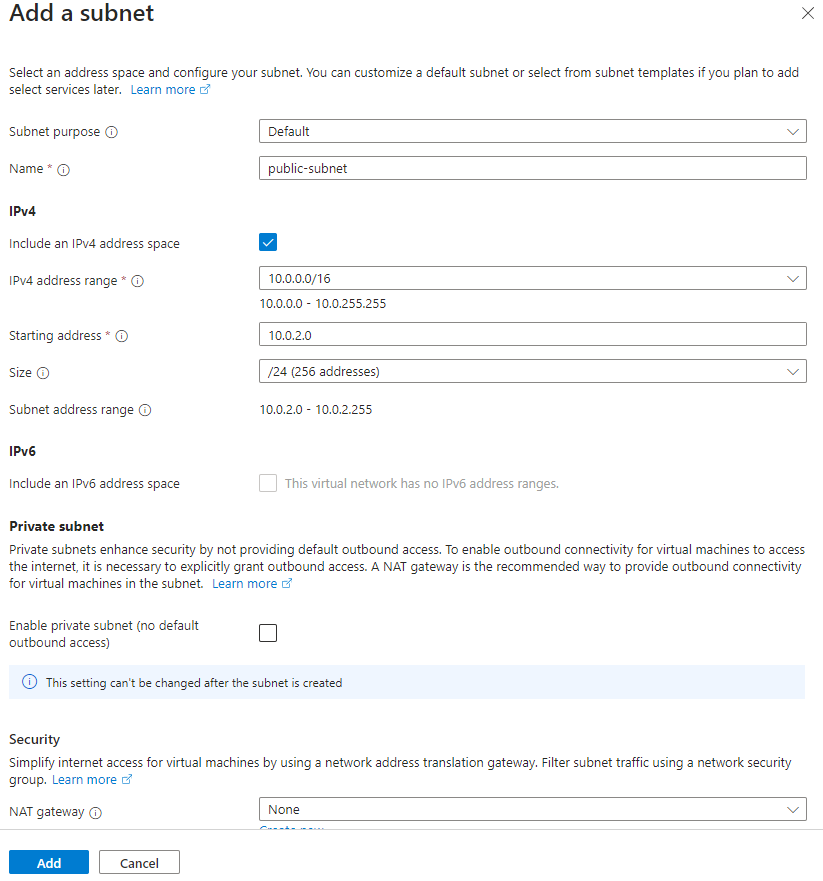
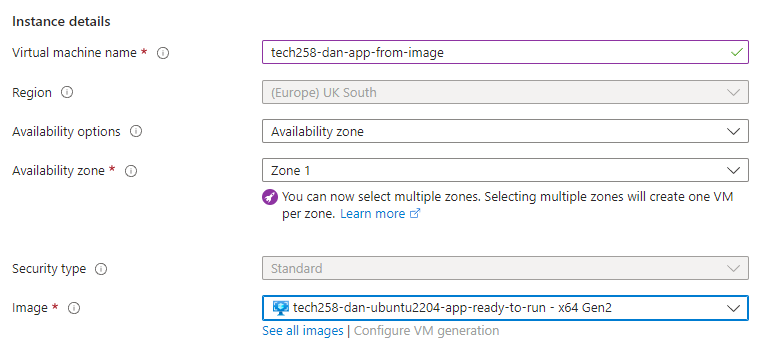

# 2 tier app deployment in azure

- [2 tier app deployment in azure](#2-tier-app-deployment-in-azure)
    - [1. Create virtual networks ](#1-create-virtual-networks-)
  - [2. Virtual Machine set up ](#2-virtual-machine-set-up-)
  - [3. Database VM ](#3-database-vm-)
  - [4. SSH into Vms ](#4-ssh-into-vms-)
  - [5. Check](#5-check)
  - [6. Difference between Azure and AWS](#6-difference-between-azure-and-aws)
  - [7. Using User Data](#7-using-user-data)
  - [8. Cleaning up resources](#8-cleaning-up-resources)
  - [9. Machine images](#9-machine-images)
      - [What is an Image](#what-is-an-image)
      - [What is not inlcuded](#what-is-not-inlcuded)
    - [How to set up custom image](#how-to-set-up-custom-image)
        - [DB](#db)
        - [App](#app)
    - [Side effects of making a machine image on azure](#side-effects-of-making-a-machine-image-on-azure)
    - [User data needed when image is used](#user-data-needed-when-image-is-used)


### 1. Create virtual networks <br><br>
   1. Go to virtual networks and then ***"Create"*** on the left <br><br>

       <br><br>

   2. Subnet + Resource group and name <br><br>
    <br><br>
   click next and next again until you get to IP addressess<br><br>
    <br><br>
   3. click ***"Add a subnet"***<br><br>
   
      make two subnets:<br><br>
      1. First one: Subnet name: public-subnet, Address range: 10.0.2.0/24

        <br><br>

       Press add <br><br>

       2. Second one: Subnet name: private-subnet, Address range: 10.0.3.0/24 <br><br>

         <br><br>

        Press add<br><br>
    4. Add your tags  <br><br>

         <br><br>
    5. click ***"Review + create"***  and then ***"Create"*** <br><br>

## 2. Virtual Machine set up <br><br>
   1. App VM <br><br>

         go to virtual machines <br><br>
          <br><br>
         click create <br><br>
          <br><br>
    
         Our chosen parameters were given to us so follow if you want to use those (pictures) or choose your own. <br><br>
   
   2. Basics <br><br>

         sub + resource group and availability <br><br>
          <br><br>
         image and size :warning: choose standard for security type <br><br>  <br><br>
          <br><br>
         choose admin account name and key <br><br>
          <br><br>
         choose basic inbound ports (optional -can edit and create security group later) <br><br>
          <br><br>
         once done click next:Disks <br><br>
   3. Disks <br><br>
         choose disk size and click next: networking <br><br>
       <br><br>
   4. Networking <br><br>
      1. Choose your virtual network you created earlier and your **<ins> public subnet for the app and private subnet for the database**. In this instance you can allow it to create a new public ip. <br><br>
      2. Choose advanced for ***"NIC network security group"*** <br><br>

           <br><br>
      3. under ***"Configure network security group"*** click ***"Create new"*** <br><br>

            Add appropriate name and inbound rules <br><br>

           <br><br>

           Should end up with this <br><br>

            <br><br>

         Click ***"OK"*** <br><br>

         (optional) check the box that says delete public ip and NIC with vm so when its terminated we dont have that resource. We can keep it if we want to reuse it. This is diff from aws <br><br>

       5. Click ***"Review + create"*** and add the same tags as the virtual network. Then click ***"Create"*** <br><br> 

## 3. Database VM <br><br>

Follow the same steps except this time we only need port 22 open for ssh (see ***basics*** above) so dont need to create a nsg. One will be created for you. :warning: Remember to use the private IP for database vm in the script for the app VM! <br><br> :warning: ENSURE RIGHT DB IMAGE OR SCRIPT MAY NOT OPERATE <br><br>

## 4. SSH into Vms <br><br>

Once made we want to ssh into our VMs and run our scripts we made before. [DB SCRIPT](https://github.com/dahm641/tech258_cloud/blob/main/linux/app/db_script.sh) [APP SCRIPT](https://github.com/dahm641/tech258_cloud/blob/main/linux/app/app_script.sh) <br><br>
:warning: Run db script first on db vm then app script on app vm <br><br>

We can SSH by finding our vm and clicking ***"connect"*** <br><br>
 <br><br>
then click into ***"Native SSH"*** <br><br> 

## 5. Check

Check all is running by using public IP of app vm and adding /posts to the end of it

## 6. Difference between Azure and AWS


- We need resource groups and subscriptions for every resource we create
- The IP address is a resource and can be reused by default - even if the vm is terminated 
- For this case, we had to create our own virtual network and subnets
- Many more options that we need to fill out compared to AWS which abstracts some of this away from us. Could be seen as a positive or a negative.
- Name when connecting via bash shell the user@ is the name of the vm rather than ip address on azure
- By default, Azure allows all internal traffic on all ports whereas AWS does not allow any by default

## 7. Using User Data

- We can use user data to run a script or commands without logging in to the instance. This speeds up the process of setting up our instance as it removes any time taken for logging in. 
- Scripts only run once as soon as the VM is created. Once and only once. If user input is required then it wont run. 
- If there is an error it can be very hard to find so **ensure you are confident with your script and run it in the terminal**
- To add user data go to the ***"advanced"*** tab when launching an instance and there should be a box for it
- 
- Once you click create it will run the script
- We can check its running by ssh into the vm and using `syystemctl` command 
- 

## 8. Cleaning up resources

-  When we create VMs we create NICs NSGs IPs and these arent deleted when we remove or terminate a VM. We have to delete them manualy
-  We can select this box to delete them with the vm <br>

-  We can also go to all resources and use our tag (this is why tagging and naming is important) and filtr by our name

-  From here we can see all our resources and delete as appropriate 
  
## 9. Machine images

#### What is an Image

Machine images are, simply put, a snapshot of the disk / replica of the disk. By this we mean that the image, for example Ubuntu, and all of its files to run are stored in the image. We chose this before so the operating system was instantly avaiable to us. When we add our script and install new files, we dont want to do this everytime. We can save the newly installed files and configurations (like nginx) which would be saved on the disk attached to the vm with the operating system on it.

 We can replicate this / take a snapshot of it so if we were to deploy it again all the installed fles would be there for us already as we can just attach this disk straight to the machine. We wouldnt have to install these files and packages again. <br> This can save us lots of time and we can run a much shorter script if we want to provision again. We wouldnt need to install nginx or even download our app. All we would need to do is run our app and set our HOST_DB environment variable.

 We can see from this diagram how we have sped up a manual process through automation in stages: <br><br>
 

 Having to no longer write our script out manually and using a script speeds up deployment. No longer having to SSH in improves deployments speed and by reducing our script using custom images that have our configurations installed (not securtiy groups or SSH keys) on our operating system already, it enables our app or db to be up and running at a much quicker rate than before.

 On azure the image is called a mchine image and on aws it is called an amazon machine image, or, AMI for short.

 #### What is not inlcuded

 As mentioned before, security groups, SSH keys and all other aspects to do with how to VM interacts with the network are not included. It doesnt run non system processes like our app we still hae to start these. Anyything that is a system process will be running however. 
 
 It only includes files, OS and OS settings and anything that runs specifically on the disk the OS runs on (the disk attached to the vm). like pre-installed software, configuration settings, and possibly data that is bundled together to create a reusable template for deploying virtual machines.

 Here is a complete breakdown:

1. **Dynamic Data**: Machine images usually contain static configurations and software installations. Any dynamic data or changes made to the system after the image was created will not be included.

2. **User Data**: Information specific to users, such as user accounts, passwords, and personal files, are typically not included in machine images.

3. **Temporary Files**: Temporary files and caches that are not part of the base configuration are generally excluded.

4. **Customizations**: Any customizations made to the system post-deployment, such as software updates, additional software installations, or specific configurations tailored to a particular use case, will not be included in the machine image unless explicitly saved as part of the image creation process.

5. **Networking Configuration**: Specific network settings, such as IP addresses, DNS configuration, and firewall rules, are usually not included in machine images as they can vary depending on the deployment environment.

6. **Security Credentials**: Machine images typically do not include sensitive security credentials such as SSH keys, SSL certificates, or authentication tokens.

7. **External Dependencies**: External dependencies or services that the system relies on but are not included in the image itself, such as database servers, external APIs, or cloud services, are not part of the machine image.


### How to set up custom image

Go to vm and overview tab and click capture


Then when it says ***"Share image to Azure compute gallery"*** select ***"No"***


Once done then we can relaunch using our image

##### DB


Choose db image from earlier


Dont add any user data and set up configurations such as network and ssh and tags.  :warning: If you are asked to choose licencing type then choose other (basics tab)


Use this in the user data to start mongo db service

```
sudo systemctl start mongod
```

##### App

Same as db so choose your app image from earlier



Then same as before set up normal configurations


Then we need to add user data before creating and we only need the following

```
#!bin/bash
export DB_HOST=mongodb://10.0.3.7:27017/posts
cd /tech258_sparta_test_app/app
sudo -E npm install
sudo -E npm install -g pm2
sudo pm2 stop all
sudo -E pm2 start app.js
sudo -E pm2 restart app.js
```

we can comment out `DB_HOST` if we dont need the /posts page to work. This will mean the app wont connect to the database as we have not specified where it is located.


### Side effects of making a machine image on azure

Using the above method it deallocates the vm machine. The disk gets removed from the VM so its no longer running. The disk is used to create the image.


### User data needed when image is used 

we can comment out `DB_HOSTNAME` if we dont need the /posts page to work. This will mean the app wont connect to the database as we have not specified where it is located.


 
 

