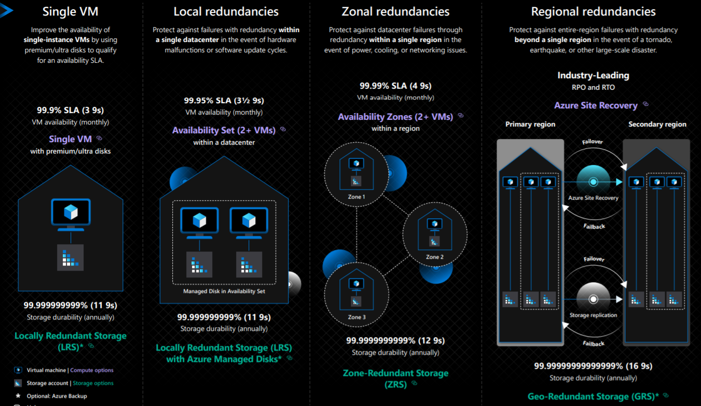
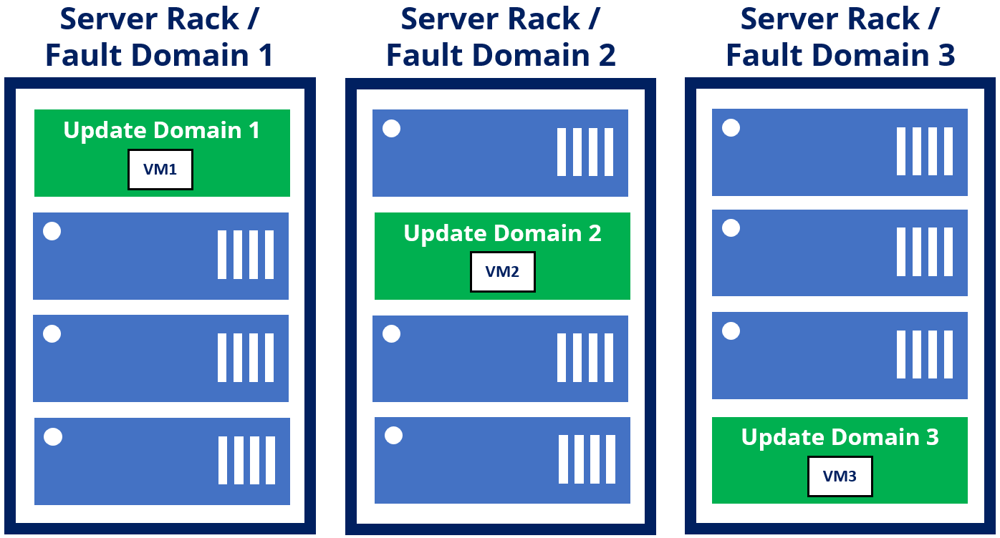

# Azure Intro

**Azure Regions and Availability Zones:**

Azure is organized into regions, which are geographic locations where Azure resources are hosted. Each region is a separate geographic area with its own datacenters. Azure regions are interconnected through a high-speed network backbone, allowing data to be replicated and accessed globally.

- **Regions**: Azure regions are isolated from one another to ensure data residency, compliance, and disaster recovery. Microsoft continues to expand its datacenter footprint to new regions around the world. As of my last update, Azure operates in more than 60 regions worldwide.

- **Availability Zones**: Availability Zones are physically separate datacenters within an Azure region. They are designed to provide redundancy and fault tolerance within a region. Each Availability Zone has independent power, cooling, and networking infrastructure, reducing the risk of a single point of failure. Azure guarantees a minimum of three Availability Zones in most regions.

Here's a basic diagram illustrating Azure regions and Availability Zones:

**Azure Structure/Organization:**

Azure is organized into multiple hierarchies:

- **Subscriptions**: Each Azure customer has one or more subscriptions, which serve as billing units and access control boundaries.
- **Resource Groups**: Resources in Azure are grouped into resource groups for management, billing, and access control purposes.
- **Resources**: Azure resources include virtual machines, databases, storage accounts, and more. These resources are provisioned and managed within resource groups.

**Types of Azure Services:**

Azure provides a wide range of services across various categories, including:

- **Compute**: Virtual machines, container services (e.g., Azure Kubernetes Service), serverless computing (e.g., Azure Functions).
- **Storage**: Blob storage, file storage, disk storage, archival storage.
- **Networking**: Virtual networks, load balancers, VPN gateways, content delivery network (CDN).
- **Databases**: Azure SQL Database, Cosmos DB, MySQL, PostgreSQL.
- **AI and Machine Learning**: Azure Cognitive Services, Azure Machine Learning.
- **Developer Tools**: Azure DevOps, Visual Studio, GitHub.
- **Security and Identity**: Azure Active Directory, Key Vault, Azure Security Center.
- **IoT**: Azure IoT Hub, IoT Central, IoT Edge.

**Ways to Access Azure:**

- **Azure Portal**: A web-based interface for managing Azure resources.
- **Azure CLI**: A command-line interface for managing Azure resources.
- **Azure PowerShell**: A PowerShell module for managing Azure resources.
- **Azure REST API**: Allows programmatic access to Azure resources.
- **Azure SDKs**: Software development kits for various programming languages.

**Difference Between Azure and Azure DevOps:**

- **Azure**: Azure is a cloud computing platform that provides a wide range of infrastructure and platform services for building, deploying, and managing applications and services. It includes services for compute, storage, networking, databases, AI, machine learning, and more.

- **Azure DevOps**: Azure DevOps is a set of cloud-based collaboration tools for software development, including version control (Azure Repos/GitHub), continuous integration and delivery (Azure Pipelines), project management (Azure Boards), and testing (Azure Test Plans).

**Azure Pricing Calculator:**

The Azure Pricing Calculator is a tool provided by Microsoft to estimate the cost of Azure services based on usage and configurations. It allows users to select the Azure services they need, configure parameters such as region, storage, compute resources, and estimate the monthly cost. The Pricing Calculator helps customers plan and budget for Azure deployments by providing transparency and cost predictability. It also allows users to compare pricing across different Azure regions and service tiers.

### Availability sets
#### Saving VMs from Host Reboots with Update Domains

Azure virtual machines are no different than on-premises virtual machines in that virtual machines exist on a single physical host server. An update domain represents the physical host server and virtual machines that Azure can reboot simultaneously.

Think about an application hosted on three virtual machines. Those three virtual machines should not be hosted on the same host server. If that host server experienced a failure, all three virtual machines go offline, and the application is no longer available. An update domain solves this problem.

When you associate VMs with an availability set, Azure will automatically place VMs into separate update domains. As an availability set places VMs into separate domains, it prevents multiple virtual machines from going offline. Update domains also keep virtual machines up when Azure performs maintenance or the host experiences a failure.

***Think of update domains as the physical server your vm runs on.***

During planned maintenance, Azure can reboot update domains in any order. However, Azure guarantees it will only reboot one update domain at a time. Azure gives a rebooted update domain 30 minutes to recover before moving to the next update domain during maintenance.

Availability sets can have up to 20 update domains.

#### Avoiding VM Outages with Fault Domains

***Think of a fault domain  like a server rack.***

When a server rack loses power that your VM is hosted on, causing physical problems, VM will typically go offline; fault domains prevent that. A fault domain is a group of virtual machines that share these common hardware components. In Azure’s case, a fault domain is a single rack installed with multiple servers.

Azure places virtual machines across up to three fault domains in an availability set. If you review the update domain diagram from the previous section, VM2 and VM3 are hosted in Server Rack 2. VM3 should be in a different fault domain for true application high availability, as you see below.

By placing each virtual machine into a different server rack (or fault domain), Azure limits the impact of hardware failures on the host servers and their virtual machines.

Azure also pairs virtual machines with disk fault domains to ensure that virtual machines have managed disks attached to the same fault domains.

### Availability Set Best Practices
To take full advantage of availability sets, below are a few best practices.

- Create the availability set before creating virtual machines. Plan out the required fault domains and update domains to support the virtual machine workload.
- Specify the availability set when creating a virtual machine. Azure cannot add an existing virtual machine to an availability set after Azure has provisioned the virtual machine. If you need to add a current virtual machine to an availability set, you redeploy the virtual machine.
- Group virtual machines with similar functions into separate availability sets. For example, if you have a three-tier application, place the virtual machines for each tier into their own availability set.
- Use managed disks for virtual machines. Virtual machines in an availability set have better reliability with managed disks. The managed disks are isolated from each other to protect against single points of failure.