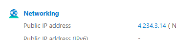

# Secure DB with a Network Virtual Appliance (NVA) 


- [Secure DB with a Network Virtual Appliance (NVA)](#secure-db-with-a-network-virtual-appliance-nva)
  - [How does it help?](#how-does-it-help)
  - [How does it work?](#how-does-it-work)
  - [How to set up](#how-to-set-up)
    - [Virtual network](#virtual-network)
    - [Database VM](#database-vm)
    - [App VM](#app-vm)
    - [NVA setup](#nva-setup)
      - [IP forwarding](#ip-forwarding)
    - [Route table](#route-table)
    - [Securing Further](#securing-further)


## What is it and how does it help?

A network virtual appliance is a VM that checks incoming and outgoing traffic.

It is placed in something called a DMZ a demilitarized zone. This is a dedicated network space that can act as a barrier between the outside and your local network. It adds an additional layer of security to your network because its a place where requests will go to first before going to your internal network.

Having an NVA is like having an additional dedicated layer of security. Think of it as a firewall. It lives in its own DMZ subnet and filters out any requests. This means that it can choose what can get access and to where. 
- It has its own rules and helps to divert internal traffic
- It is like having a gate before your house. You don't want all the traffic handled at your front door you don't even want people at your front for. This acts as a gate before anyone can even get access to your front door.
- This increases the security because now it's harder for any traffic to get to our DB subnet because any requests get filtered by our NVA and only the right requests will make it through before being checked again by the NSG of the db or its subnet

## How does it work?
1. From the diagram we can see we connect to our app like normal. 
2. Our app then needs to go to the database.
3. It goes through a routing table that we created to know where it needs to go (predefined route it needs to take)
4. From the routing table it goes to our NVA
5. Our NVA processes the request with its own rules and sends it to our DB subnet 
6. From there it goes to the NSG and to the DB, and then it sends back the data

## How to set up


We will set it up using the diagram with the steps labelled above

### Virtual network

1. First we need to create our virtual network with 3 subnets so go to virtual networks and click create. Don't forget tags <br><br>
  <br><br>

2. Add the subnets.  <br><br>
   1. Public 10.0.2.0/24
   2. DMZ 10.0.3.0/24
   3. Private 10.0.4.0/24 and for *only* this one check the private subnet box <br><br>
     <br><br>
Should end up with this (make sure virtual network address space as shown): <br><br> 
  <br><br>

3. Add tags and create

### Database VM

1. Create a VM as normal using the DB image
2. You can find the image and create it that way  <br><br>
   <br><br>
3. Private subnet and open port 22 for ssh
4. Dont create a public IP  <br><br>
  <br><br>
  <br><br>
5. Add tags and create

### App VM

1. Create vm as normal or go to image and create from there same as earlier  <br><br>
  <br><br>
2. Put it in the public subnet with ports 80 and 22 open for ssh and http
3. Add user data to run the app. Copy the database private IP created in the last step and add that to the user data 
    ```
    #!bin/bash
    export DB_HOST=mongodb://privateip:27017/posts
    cd /tech258_sparta_test_app/app
    sudo -E npm install
    sudo pm2 stop all
    sudo -E pm2 start app.js
    sudo -E pm2 restart app.js
    ```
4. Check details, choose tags and create <br><br>
  <br><br>
5. Check app is running by using public ip and also checking if database is running using /posts after the public IP  <br><br>
  <br><br>
  <br><br>
  <br><br>
6. Done!

### NVA setup

1. Set up a regular VM with Ubuntu 22.04
2. Allow SSH
3. Put it in availability zone 2. Each VM in their own zone incase one zone fails. We can spin up the part of our app that has failed.
4. Place it in the ***dmz-subnet*** we created with our virtual network
5. Add tags, check details and create  <br><br>
  <br><br>

#### IP forwarding 

1. We need to go to the NIC and enable IP forwarding. We do this by going to the instance, scrolling to network settings and clicking the network interface highlighted in yellow <br><br>
 <br><br>
We do this so that the app wil be able to first be routed to our NVA then our NVA can forward the IP and send it to the database if it meets the rules we will set up <br><br> 

2. Tick the checkbox to enable IP forwarding to allow us to send traffic from the NVA to the database  <br><br>
 <br><br>
   3. Now we need to SSH into our NVA and set up IP forwarding on the VM and also set our rules.
      1. Once we SSH in and first enable IP forwarding.
      2. We can see it's not running when we do this command `sysctl net.ipv4.ip_forward`  <br><br>
      3.  <br><br> If it says =0 it means its off  <br><br>
      4. Run this command to change the file `sudo nano /etc/sysctl.conf`  <br><br>
      5.   <br><br> Uncomment the shown line and save the file <br><br>
      6. We now have to restart the process to update the new variables (apply our changes) use the command `sudo sysctl -p`
      7. It should now say that it =1 meaning its enabled  <br><br>   <br><br>
      8. Now we have to create our IP table rules. This only allows certain packets to be sent so adds to our security.
         1. We can create a script using `nano script.sh` and then using this script:
         2. *Generally, we need to update the packages on our instance before running the script, but I have added it to the script to save time.*
            ```
            #!/bin/bash
            # update and upgrade packages
            sudo apt update -y
            sudo DEBIAN_FRONTEND=noninteractive apt upgrade -y  
            # configure iptables
         
            echo "Configuring iptables..."
         
             # Allows all traffic on the loopback interface (localhost). 
             # The loopback interface is a virtual network interface that your computer uses to communicate with itself. 
             # This is commonly used by applications and services running on the system to communicate internally without going through the network stack.
             sudo iptables -A INPUT -i lo -j ACCEPT  # Allow incoming traffic on the loopback interface
             sudo iptables -A OUTPUT -o lo -j ACCEPT # Allow outgoing traffic on the loopback interface
            
             # Allows incoming packets that are part of established or related connections
             sudo iptables -A INPUT -m state --state ESTABLISHED,RELATED -j ACCEPT  # Allow incoming packets related to established connections
            
             # Allows outgoing packets that are part of established connections
             sudo iptables -A OUTPUT -m state --state ESTABLISHED -j ACCEPT  # Allow outgoing packets related to established connections
            
             # Drops incoming packets that are marked as invalid
             sudo iptables -A INPUT -m state --state INVALID -j DROP  # Drop incoming packets that are marked as invalid
            
             # Allows incoming SSH connections on port 22
             sudo iptables -A INPUT -p tcp --dport 22 -m state --state NEW,ESTABLISHED -j ACCEPT  # Allow incoming SSH connections on port 22
             sudo iptables -A OUTPUT -p tcp --sport 22 -m state --state ESTABLISHED -j ACCEPT  # Allow outgoing responses to SSH connections
            
             # Allows forwarding of TCP traffic from subnet 10.0.2.0/24 to subnet 10.0.4.0/24 on port 27017 (example for MongoDB)
             sudo iptables -A FORWARD -p tcp -s 10.0.2.0/24 -d 10.0.4.0/24 --destination-port 27017 -m tcp -j ACCEPT  # Allow forwarding of TCP traffic from one subnet to another on specified port
            
             # Allows forwarding of ICMP traffic from subnet 10.0.2.0/24 to subnet 10.0.4.0/24 (example for ping)
             sudo iptables -A FORWARD -p icmp -s 10.0.2.0/24 -d 10.0.4.0/24 -m state --state NEW,ESTABLISHED -j ACCEPT  # Allow forwarding of ICMP (ping) traffic from one subnet to another
            
             # Sets default policy for incoming packets to DROP (rejects all incoming packets by default)
             sudo iptables -P INPUT DROP  # Set default policy for incoming packets to DROP
            
             # Sets default policy for forwarded packets to DROP (rejects all forwarded packets by default)
             sudo iptables -P FORWARD DROP  # Set default policy for forwarded packets to DROP
    
    
         
              echo "Done!"
              echo ""
                 
              # make iptables rules persistent
              # it will ask for user input by default
                 
              echo "Make iptables rules persistent..."
              sudo DEBIAN_FRONTEND=noninteractive apt install iptables-persistent -y
              echo "Done!"
              echo ""
              ```
              - More information on route tables at bottom of page <br><br>
   
         3. Save it and run it using `bash script.sh` <br> <br>
4. Now we need to create a route table to actually send traffic to this NVA


### Route table

1. Search for route tables in azure  <br><br>
  <br><br>
2. Create the route table and add tags <br><br>
 <br><br>
3. Create a route 
   - This tells the traffic the exact path to take.
   - We want our app to go to our NVA then to our Database
   - We set this up by saying our next hop (where it should go to first) is the NVM private IP (highlighted in green)
   - We say our destination or where it should end up is our private subnet, so we state this also (blue) <br><br>
      <br><br>
4. We then associate it with our public subnet so traffic going from there knows which route to take <br><br><br> 
5. Go to subnets and click associate <br><br>  <br><br>
6. Choose your public subnet and associate the route table to it.
7. test it works by using your public ip for the app and adding /posts to it <br><br> 
 <br><br>
1. Done!

### Securing Further

1. We can adjust our DB NSG to do the following
   - Allow SSH from public subnet 
   - Allow Mongo DB from public subnet 
   - Allow ICMP from public subnet (optional)
   - Deny everything else 
   We can do this by going to our VM and scrolling down to network until we get to here <br><br>
    <br><br>

2. Click create port rule to add rules. Add the inbound rules above. <br><br>
 <br><br>
3. Make sure the ***deny*** rule has the lowest priority (highest number) so it executes after above rules. If you don't it will just deny everything as that's higher priority. Also ensure you delete the regular SSH from anywhere rule.
4. Check to see if app still running.
5. We can also change our bind ip on our mongodb to not allow requests from anywhere to further enhance security.


#### Extra information on route tables


1. **Loopback Interface Allowance**: 
    - The commands:
        ```bash
        sudo iptables -A INPUT -i lo -j ACCEPT
        sudo iptables -A OUTPUT -o lo -j ACCEPT
        ```
        allow all traffic on the loopback interface (`lo`). The loopback interface is a virtual network interface that your computer uses to communicate with itself. This is commonly used by applications and services running on the system to communicate internally without going through the network stack.

2. **Established and Related Connections**:
    - The command:
        ```bash
        sudo iptables -A INPUT -m state --state ESTABLISHED,RELATED -j ACCEPT
        ```
        allows incoming packets that are part of established or related connections. This is important for maintaining existing connections and ensuring that packets related to those connections (such as responses to outbound requests) are allowed.

3. **Outgoing Established Connections**:
    - The command:
        ```bash
        sudo iptables -A OUTPUT -m state --state ESTABLISHED -j ACCEPT
        ```
        allows outgoing packets that are part of established connections. This ensures that responses to outgoing requests are allowed to leave the system.

Allowing traffic from established connections ensures that responses to outgoing requests are permitted. For example, if your system initiates a request to a remote server (such as a web server), the response from that server is part of an established connection. By allowing traffic from established connections, you permit these response packets to return to your system, completing the communication.

In essence, established connections are those connections that have been set up and are currently in use, either for sending or receiving data. It's important to allow traffic from established connections to ensure that legitimate communication can occur without being blocked by firewall rules.


4. **Invalid Packets Dropping**:
    - The command:
        ```bash
        sudo iptables -A INPUT -m state --state INVALID -j DROP
        ```
        drops incoming packets that are marked as invalid. This helps protect against various types of attacks and ensures that only valid packets are processed further.

5. **SSH Connection Allowance**:
    - The commands:
        ```bash
        sudo iptables -A INPUT -p tcp --dport 22 -m state --state NEW,ESTABLISHED -j ACCEPT
        sudo iptables -A OUTPUT -p tcp --sport 22 -m state --state ESTABLISHED -j ACCEPT
        ```
        allow incoming SSH connections on port 22 (default SSH port) and allow outgoing responses to those connections. This is important for remote access to the system over SSH.

6. **Forwarding TCP Traffic**:
    - The command:
        ```bash
        sudo iptables -A FORWARD -p tcp -s 10.0.2.0/24 -d 10.0.4.0/24 --destination-port 27017 -m tcp -j ACCEPT
        ```
        allows forwarding of TCP traffic from subnet 10.0.2.0/24 to subnet 10.0.4.0/24 on port 27017. This is commonly used for applications like MongoDB.

7. **Forwarding ICMP Traffic**:
    - The command:
        ```bash
        sudo iptables -A FORWARD -p icmp -s 10.0.2.0/24 -d 10.0.4.0/24 -m state --state NEW,ESTABLISHED -j ACCEPT
        ```
        allows forwarding of ICMP (ping) traffic from subnet 10.0.2.0/24 to subnet 10.0.4.0/24. This allows machines in one subnet to ping machines in another subnet.

8. **Default Policy Setting for Incoming Packets**:
    - The command:
        ```bash
        sudo iptables -P INPUT DROP
        ```
        sets the default policy for incoming packets to DROP, which means that all incoming packets that do not match any specific rule will be dropped (rejected).

9. **Default Policy Setting for Forwarded Packets**:
    - The command:
        ```bash
        sudo iptables -P FORWARD DROP
        ```
        sets the default policy for forwarded packets to DROP, which means that all forwarded packets that do not match any specific rule will be dropped (rejected).

These iptables rules help manage network traffic on the system, allowing certain types of traffic while blocking others based on specified criteria.


