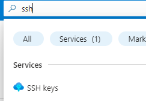
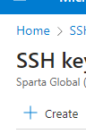
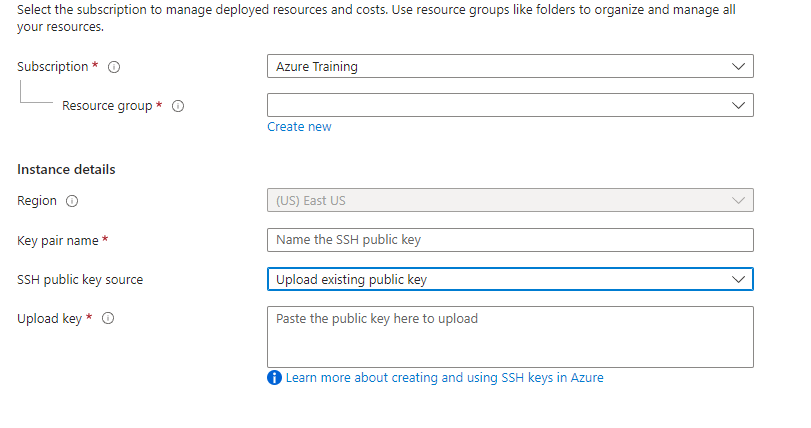

# How to crate ssh for Azure

## Firstly create SSH Key pair locally

## In depth tutorial to create ssh keys and view public key [here](https://github.com/dahm641/tech258_git/blob/main/SSH%20Keys/ssh_keys_setup.md)

### <ins> Quick instructions:

### 1. First open your bash terminal and navigate to your .ssh folder. This can be done by using
   ```
   cd
   cd .ssh
   ```
  using cd to navigate to your home folder then cd again to navigate to your .ssh folder should be there. (If not then create one)
### 2. create your ssh key pair using the following command
    
    ssh-keygen -t rsa -b 4096 -C "<YOUR_EMAIL>"
    
## Secondly upload to Azure

### 1. find your public key using the name you created:
    
    cat <keyname>.pub
    
   Copy this key <br><br>
### 2. Open Azure and search for ssh keys <br><br> 


### 3. Click *create* <br><br>


### 4. Upload they key.


    - Ensure you chose the appropriate subscription and resource group
    - Name the key
    - Paste the public key into the space provided
    - Press **next** and appropriate tags