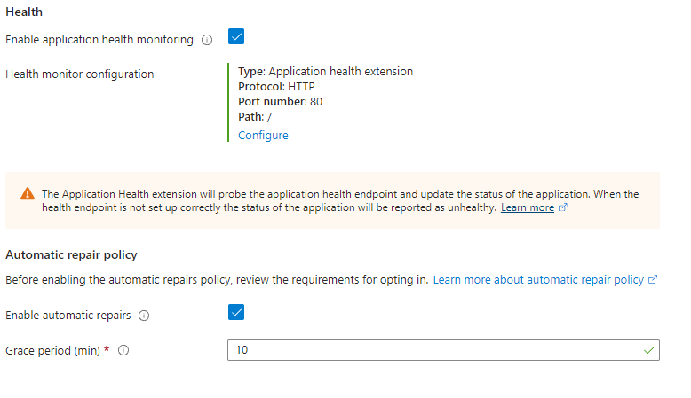

# Scale sets

- [Scale sets](#scale-sets)
  - [What are scale sets?](#what-are-scale-sets)
  - [How to make a scale set](#how-to-make-a-scale-set)
    - [Prerequisites](#prerequisites)
  - [Managing instances](#managing-instances)
    - [Upgrading](#upgrading)
    - [Re-imaging](#re-imaging)
  - [SSH into instances](#ssh-into-instances)
  - [Deleting](#deleting)


## What are scale sets?

- Scale sets are a way to automatically provision more VMs based on metrics we set
- They can scale both out and in depending on conditions
- They provide high availability because they make sure that we always have instances running and that they won't be overloaded and shut off, so they are always available. Highly available.
- We need them because they allow us to have high availability and high scalability AUTOMATICALLY, reacting dynamically to changes without the need for any human intervention/input.

    

- In the picture we can see that we have our rules so that there will be always 2 instances. If one goes down then we will have another to fall back on immediately
- We create the Scale set in our subnet
- We then have a load balancer to balance the traffic between VMs and act as a single point of contact.
- This way we don't need to connect to each VM individually, we can just connect to the load balancer, and it will redirect us to the best server.
- High availability we need to allow it to distribute VMs automatically across different zones
- Load balancer belongs in virtual network and not in a subnet

## How to make a scale set

### Prerequisites 

- Image with user data needs to be confirmed working with confidence.
- Launched a regular VM with script to ensure this.

1. Search for scale sets in Azure and click create
2. Select your subscription, resource group, name, and availability zones. Uniform orchestration mode for identical VMs
   - We want to choose all three because we want high availability. In case one zone goes down we don't lose all our machines in that zone. <br> <br>
       
    <br><br>
3. Choose ***"Autoscaling"*** and click configure <br><br>
  <br><br>
4. Edit default condition <br><br>
 <br><br>
   - We want minimum of 2 instances at all times in case one fails unexpectedly. We want a maximum of 3 at any iven time. We want it to scale when the CPU is over 75% usage across both our instances (average) for a set duration of time (10 min). Click save when done and save again. <br><br>
   <br><br>
5. Choose your image and SSH and licencing details. <br><br>
 <br><br>
6. Skip spot and go to disks to select ***"standard ssd"*** <br><br>
7. Go to networking and select your VNet and edit your NIC <br><br>
 <br><br>
8. Choose your subnet and network security group and mae sure public IP is disabled because we don't need instances to have public IPs we only want our load balancer to have one. (saves money and better security) <br><br>
9. Go to load balancing, select azure load balancer and create a load balancer  <br><br>
 <br><br>
 <br><br>
   - We can specify the load balancer to handle incoming requests on one port and connect to the instances using a different port. <br><br>
   - We can also use the inbound NAT rule to ssh into our virtual machines starting by assigning each vm to a port range starting at 50000.
   - So to SSH into our first VM we would use the IP address of the load balancer but at port 50000. For our second one we would use port 50001 and so on. <br><br>
   - For example, we would use this command with the load balancer IP address and use the `-p` option to select the port <br><br>
   - `ssh -i tech258_dan_az_key -p 50000 adminuser@4.158.139.203`  <br><br>

10. Next go to health and select these options to enable health monitoring on the VMs so that azure can check they are healthy and are running. If they aren't it can delete them and provision a new one. This helps with high availability. We can set how long they are allowed to be unhealthy for using ***"Grace period"***  <br><br>
  <br><br>
11. Go to advanced and add your user data <br><br>
    ```
    #!bin/bash
    export DB_HOST=mongodb://10.0.3.7:27017/posts
    cd /tech258_sparta_test_app/app
    sudo -E npm install
    sudo pm2 stop all
    sudo -E pm2 start app.js
    sudo -E pm2 restart app.js
    ``` 
    <br><br>
12. Add tags and create! <br><br>
13. Test your scale set by using the public ip <br><br>
 <br><br>
 <br><br> 
14. Now test if the health checks are working by stopping one of the instances and restarting it  <br><br>
 <br><br>
 <br><br>
    - When we restart it, it doesn't run our user data anymore, so it gets a bad request when it tries to http in <br><br>
    - It is marked as unhealthy because it is probing it with our settings we configured earlier by seeing if we get a "200" status code when we request at http, but it won't get this because our app will no longer be running. <br><br>
    - If we just stop it, the health probe won't bother checking it so nothing will happen <br><br>
    - when it doesn't receive this, it marks it as unhealthy - aka not working <br><br>
15. After our 10-min grace period, a new instance should boot up automatically. <br><br>
 <br><br>
 <br><br>


## Managing instances
### Upgrading
- If we want to change some configurations like the user data, we can do this easily. <br><br>
-  <br><br>
- Once we change things like this, we can go to our instances page and choose our instances and upgrade them. This resets them to our image and runs the latest configurations and user data, so we don't have to create a whole new scale set. <br><br>
-  <br><br>
- All new instances will have the latest upgrade/changes <br><br>

### Re-imaging
- If we want to change the image the instances run from, we can reimage them. <br><br>
- All future instances will run this new image

## SSH into instances

- We can SSH into our instances using the method in step 9 <br><br>
- The load balancer assigns port 22 of our back end instances to its front end. <br><br>
- Our instances are behind a load balancer and only the load balancer is public facing (connected to the public internet) <br><br>
- So to get to our instances we have to go through the load balancer. <br><br>
- We cant use the normal port 22 of the load balancer because we don't want to ssh into the load balancer we want to ssh into our instances. <br><br>
- The load balancer takes port 22 of the back end instances and assigns them in order starting from port 50000 <br><br>
- So for our first instance it will be port 50000 then our second will be port 50001 and so on.
- To connect to our first instance then we would need to use our normal ssh command and the ip address of the load balancer but add `-p` to specify a port <br><br>
- `ssh -i tech258_dan_az_key -p 50000 adminuser@<public_ip_load_balancer>` <br><br>
- We can go to the instance and click connect. It will have a private IP address (highlighted in the image below) that we cant access from outside of our virtual network, so we must replace this with our load balancer public IP.  <br><br>
- 

<br><br>
## Deleting

- To delete our resources, we can either go to our resource list and search for tags and force delete all the associated resources. <br><br>
-  <br><br>
- Or we can delete our scale set then delete our load balancer then delete its public IP. <br><br>
- We have to do it in this order because the load balancer is in use by the scale set and the public ip of the load balancer is being used by the load balancer, so we must delete  dependencies first 


