# Monitoring 

## Worst to best approach to monitoring and responding to traffic

1. Worst is if we just wait fofr a server to fail
2. Ok is is if we set up monitoring and look at when our server has too much traffic and manually remedy
3. Better is if we create alerts to automatically notify us but we still have to remedy manually
4. Best is we we use auto scaling groups to automatically scale out and back in for us when the traffic is high

|     **Worst**    	|               **Ok**               	|            **Better**           	|              **Best**              	|
|:----------------:	|:----------------------------------:	|:-------------------------------:	|:----------------------------------:	|
|     CPU high     	|              CPU high              	|             CPU high            	|              CPU high              	|
|   Server fails   	| We hopefully notice on the monitor 	|    We get an automatic alert    	|            Azure notices           	|
|   Users notice   	|  If we notice in time we can scale 	|      Can act straight away      	|             Auto scales            	|
| Then take action 	|         Hopefully no issues        	| No issues on if we act on alert 	| No one notices, instantly remedied 	|

### Scaling

- Horizontal scaling (out) is when we add more instances to distribute load
- Vertical scaling (up) is when we Incrase the power of our acutal VM to handle the load
- Generally, it is much easier to scale horizontally and can be done automatically as its easy to create instances but hard to change them when we scale up.

## How to set up dashboard 

1. Go to your virtual machine
2. Click on the ***"monitoring"*** subtab  
    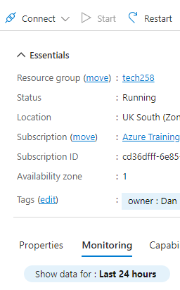

3. We can scroll to see some of our metrics. From here we can click any of them to pin to our dashboard (red circles) we then get a menu on the right where we can create a dashboard and make it either shared or private   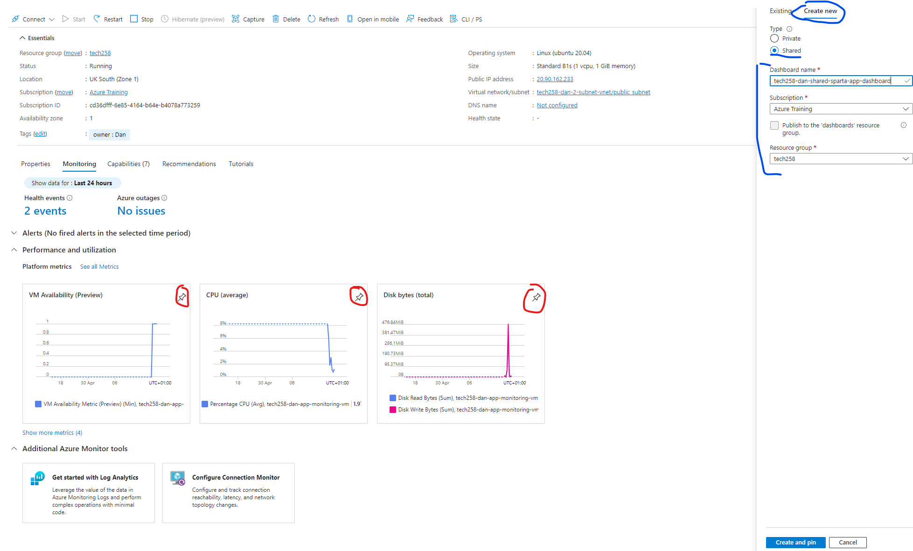
4. Now we have a dashboard set up we can find it by going to the dashboard hub and choosing the dashboard we just made  
   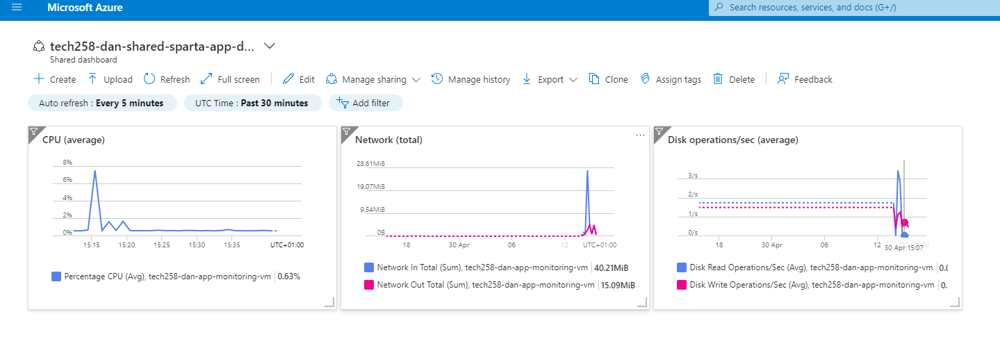
5. To test it we can ssh into our machine and install something called apache. This has a utility that allows us to test our webserver by sending a number of requests per second that we can specifiy
   1. To do this we need to SSh into our VM
   2. Then we need to run the command `sudo apt-get install apache2-utils` which will install what we need to run the utility / commands to test our server 
   3. We can then run `ab -n 2000 -c 300 http://yourwebsite.com/` where `n` is our number of requests in total and `c` is how many per second (user specified)
   4. We can then go back to our dash board to see how the cpu was tested (note: our app is ery light so cpu may no be the bottleneck in testing)
6. Going back to our dashboard after our test we should see a spike in useage.   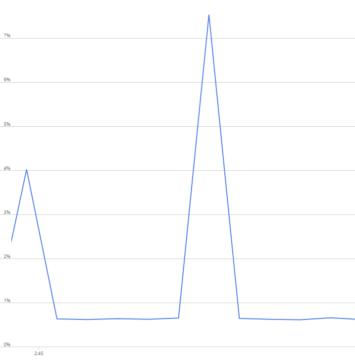   for me this was just over 7%

## Creating an alert

- When one of our metrics on our dashboard hits a certain threshold, we can get azure to notify us thorugh an alert. 
- In our case, an email alert when it hits a certain cpu threshold. This eliminates the need to constantly check the dashboard if a resource is using more than expected or that it can handle. It eliminates the need for constant human input. 
- This is a level of automation above just using a dashboard that we have to manually check.

##### Steps to create an alert

1. We need to set up an action group. we do this by going to our virtual machine and scrolling down to alerts   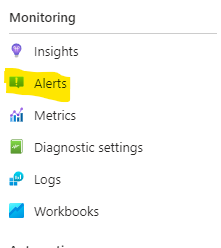
2. Then create action group and follow the steps. Dont forget to add tags at the end. 
  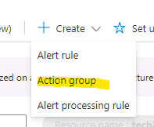  
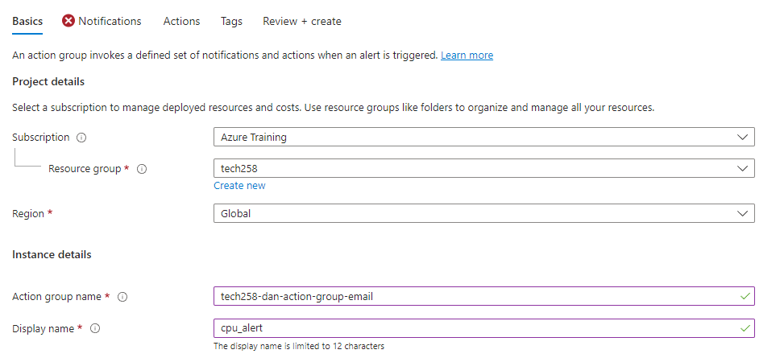   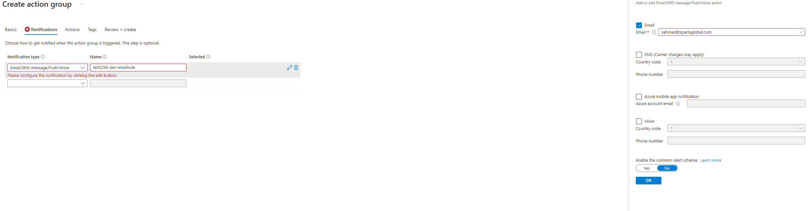 

3. Now back in alerts, create an alert rule. Same place where we created our action group.  
   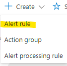
4. Set up your alert rule so that it will be triggered when you do heavy cpu load testing    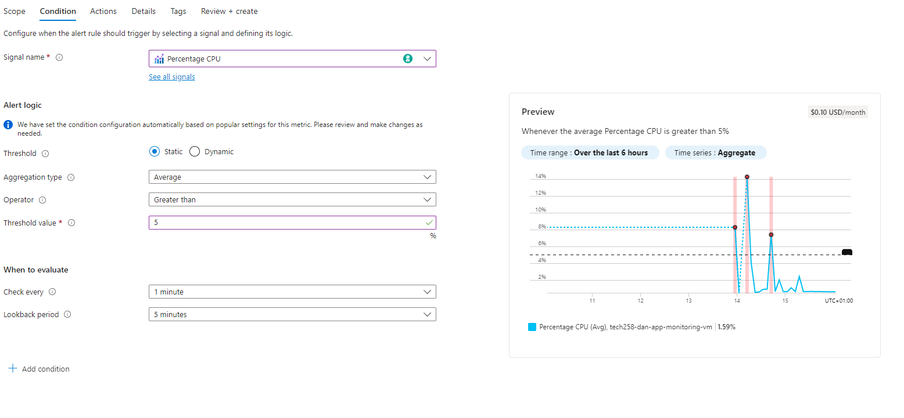 my cpu goes over 7% and the GUI helps to see this. I therefore set my alert to trigger at 5%
5. Now htat we have our alert, we need to set the action in the ***"Actions"*** tab. From here we can just chooose our action group. We could use quick actions but for now we are going to use the one we set up.   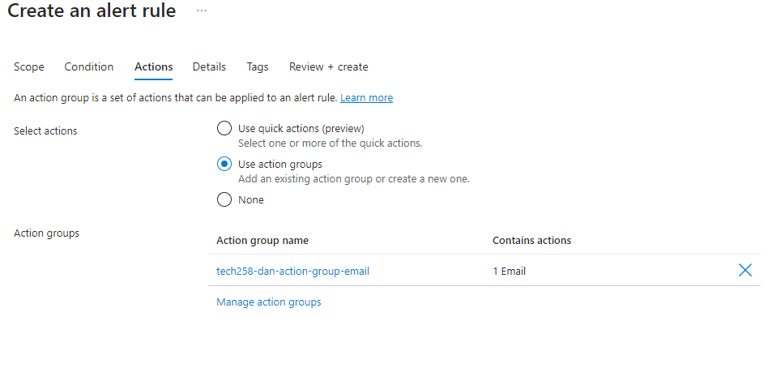 
6. Add extra details on the next tab such as the name and severity   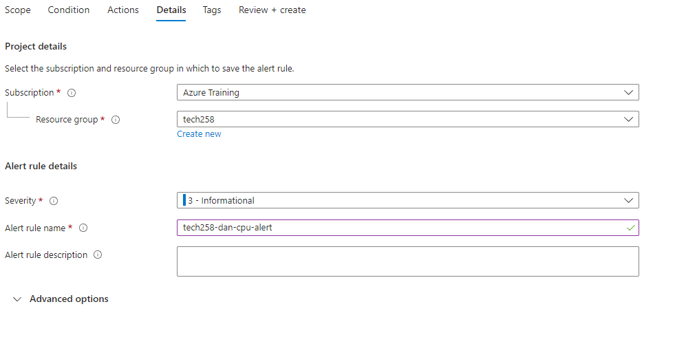
7. Add tags and click create
8. Now go back and ssh into the vm and run the command from earlier: `ab -n 2000 -c 300 http://yourwebsite.com/`
9. You should get an email alert like this   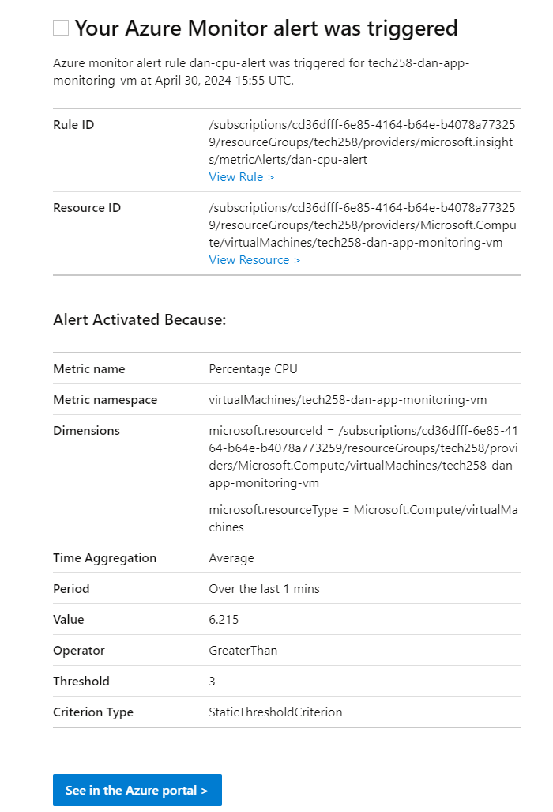   (the alert i got here was from one I set up with a lower percentage)
    