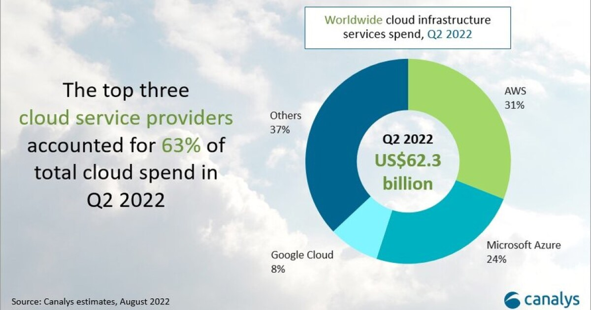

Research:

- What is cloud computing? Explain it ina way a lay person would understand.
- How do we know if something is in the cloud? Differences between on-prem and the cloud?
- The 4 deployment models of cloud: private vs public vs hybrid vs multi-cloud - Differences? How do they work?
- Types of cloud services: IaaS, PaaS, SaaS - What are differences?
- What are the advantages/disadvantages of the cloud? (Particularly for a business)
- Difference between OpEx vs CapEx and how it relates the cloud
- Is migrating to the cloud always cheaper?
- Marketshare - What is the breakdown? Add a diagram to help understand marketshare trends
- What are the 3 largest Cloud providers known for (What makes them popular? What are some of their USPs?)
- Which cloud provider do you think might be the best? Why?
- What sorts of things do you usually need to pay for when using the cloud?
- What are the 4 pillars of DevOps? How do they link into the Cloud?

If time...

Find up to 3 case studies showing how businesses have migrated to the cloud or used the cloud to improve in some way

# Cloud Computing

## What is it?

Essentially it is any computing service you may need delivered over the internet. This could be from storage for your phone like Icloud to sending an email all the way to using applications on remote servers and storing data. The cloud term comes in when it is being delivered from a remote location over the internet. Companies might like this idea because they no longer have to worry about maintaining a datacentre and can pay a subscription and have a cloud provider provide them with servers and infrastructure.  

## Difference between on prem and cloud:

#### Do we know if something is in the cloud? 
Depends on who we are. If we are an end user who just wants the product I wouldnt tell the difference (or at least I shouldnt be able to) if I wanted my spotify to play a song when I hit play I dont know or care if the data is on the cloud or on prem. I just want it to work.

If I am involved in the IT infrastructure of a company I know which resources will be hosted where and generally I will need some authentication to access them and an ip address on url and dns settings to access it. I may need my companys network in order to authorise my credentials and authenticate me so that I can access a particular instance in the cloud. 

#### The difference between on prem and cloud is simply where our compute services are coming from. On prem we are fully responsible for everything. In the cloud there is a shared responsibility (see shared responsibility model for respective cloud providers) 

## Deployment models

| Model   | Description                                                                                                                                     | Features                                                                                                                                                                                        | 
|---------|-------------------------------------------------------------------------------------------------------------------------------------------------|-------------------------------------------------------------------------------------------------------------------------------------------------------------------------------------------------|
| Public  | Public cloud services are provided by companies like Amazon, Microsoft, and Google over the internet. Many users share the same infrastructure. | - Easy to use and access.  - Pay-as-you-go pricing.                                                                                                                                          |
| Private | Like having your own cloud. It's dedicated to one organization and can be hosted on-premises or by a third-party.                               | - More control and privacy.  - Common for businesses with strict security needs.                                                                                                             |
| Hybrid  | Combines public and private clouds/on prem. It lets you use both for different needs.                                                           | - Flexibility to choose where to run each app or workload. - Can move data and apps between environments.   - Can scale into the cloud when necessary and use already owned on prem setup |
| Multi   | Multi-cloud means using services from more than one cloud provider. It's about not putting all your eggs in one basket                          | - Reduces reliance on a single provider.   - Lets you choose the best services from each provider.   - Can be complex to manage.                                                                                   |

## Types of cloud services

### Infrastructure as a Service (IaaS):

- IaaS provides virtualized computing resources over the internet.
- It includes essential computing infrastructure components like virtual machines, storage, and networking.
- With IaaS, users have full control over the operating systems, applications, and development frameworks they use.
- Examples of IaaS providers include Amazon Web Services (AWS) EC2, Microsoft Azure Virtual Machines, and Google Compute Engine.

### Platform as a Service (PaaS):

- PaaS offers a platform allowing customers to develop, run, and manage applications without dealing with the underlying infrastructure.
- It provides a complete environment for developing, testing, and deploying applications, including tools, libraries, and frameworks.
- Users can focus on writing code and building applications without worrying about managing servers or infrastructure.
- Examples of PaaS offerings include Google App Engine, Heroku, and Microsoft Azure App Service.

### Software as a Service (SaaS):

- SaaS delivers applications over the internet on a subscription basis.
- Users can access and use software applications hosted by the provider via a web browser or API without needing to install or maintain any software locally.
- SaaS providers handle maintenance, updates, and security of the software.
- Examples of SaaS applications include Google Workspace (formerly G Suite), Salesforce, Microsoft Office 365, and Dropbox.

#### In summary, IaaS provides basic computing infrastructure, PaaS offers a platform for application development and deployment, and SaaS delivers ready-to-use software applications over the internet.

## Advantages

If I had a car dealership and I needed to keep records of my customers and their finances. I dont want to go out of my way and have my own server and database. I can simply go to a cloud provider and pay a subscription. They will give me what I need and also do all the maintenance required. I can focus on my dealership company rather than IT.

It allows me to focus on the business. This is one of the benefits of using cloud as a business. Other points include:

- Elastiscity - Meet supply and demand 
- Scalability - Go global in minutes
- Resilience - Resistance to failure (multiple AZ, Region pairs)
- 

## Disadvantages

- #### Internet Reliance: 
  - You need a stable internet connection to access cloud services. If your connection is slow or goes down, you may have trouble accessing your data or applications.

- #### Security Concerns: 
  - Storing data in the cloud means trusting a third-party provider to keep it safe. There's always a risk of data breaches or unauthorized access.

- #### Data Privacy: 
  - Laws and regulations about data privacy vary by location. Storing data in the cloud may mean it's subject to different laws than if you kept it in-house.

- #### Downtime: 
  - Even the most reliable cloud services can experience outages. If your cloud provider goes down, you could lose access to your data and applications until they're back online.

- #### Costs:
  - While cloud services can be cost-effective, the expenses can add up over time, especially if you need a lot of storage or processing power.

- #### Limited Control: 
  - When you use cloud services, you're relying on someone else's infrastructure. You may not have as much control over how your data is stored or secured.

- #### Data Transfer Speed: 
  - Moving large amounts of data to and from the cloud can be slow, especially if you have a lot of data or a slow internet connection.

- #### Vendor Lock-in: 
  - Moving data and applications to the cloud can create a dependency on a particular cloud service provider. Switching providers or migrating data between providers can be complex and costly, leading to vendor lock-in.

## Capex vs OPex

Cap ex is capital expenditure. This is usually upfront costs. Op Ex is operation expenditures. How much it costs to run and opearte. In the Cloud we usually negate the Cap ex because we only use what we pay for. Commpare this with on prem where we have to pay for our IT equipment upfront then also pay the Op ex (staff, updates, electricity etc) so cloud can be very beneficial for companies to save money.

It can also scale so if we need 5x power for a week for increased demand we dont have to fork out cap ex for new servers and upgrades that will be useless after a week. We can just pay for what we need and then scale back down.

### What do we usually pay for in the cloud?

Usually we only pay for what we use. We can see this using many different monitoring tools and also we may pay for premium subscriptions which gives us access to things such as enhanced security and threat protections as well as greater support from the cloud providers themselves. We pay mainly for:
- Compute
- Storage
- Network Usage

### Is it always cheaper to use cloud?
If we already have a large on prem set up it would make no sense to move everything to the cloud. In this case it would be more expensive. We would be better off using a hybrid cloud for when we need extra demand or services.

Also if we have a fixed usage scenario that requires lots of comput power then it may be cheaper to spend the Cap Ex and over time we will save money by not paying a subscription to the cloud indefinitely.

### Market share for cloud providers

The main provider is AWS but the gap is closing. Azure is becoming more popular and then you have google and there are many others such as oracle cloud. 

### 3 top providers:

#### Amazon Web Services (AWS):

- Popular for: Huge range of services and global reach.
- Key Points:
  - Biggest and Widest: Offers the most extensive range of services and global data centers.
  - Innovation: Constantly introduces new services and features.
  - Scalability: Great for businesses of any size, from startups to enterprises.
  
#### Microsoft Azure:

 - Popular for: Integration with Microsoft's existing products and enterprise focus.
 - Key Points:
   - Integration: Seamlessly works with Microsoft products like Windows Server and Office 365.
   - Hybrid Capabilities: Great for businesses that need a mix of cloud and on-premises solutions.
   - Enterprise Solutions: Offers a wide range of services tailored to large organizations.

#### Google Cloud Platform (GCP):

- Popular for: Data analytics, machine learning, and Kubernetes expertise.
- Key Points:
  - Data and AI: Strong focus on data analytics and machine learning services.
  - Kubernetes: Known for its expertise in Kubernetes-based container orchestration.
  - Global Network: Leverages Google's extensive network for fast and reliable services

## Which cloud provider do you think might be the best? Why?

Depends on the use case entirely. Some services are faster on azure such as servers running with windows servers or microsoft databases. AWS is very flexible and has its own unique features. Oracle cloud is the best for oracle databases. Microsoft is the best for on prem hybrid set ups because it can work seamlessly with active directory and office products.

#### In my opinion its best to have a multicloud strategy so you get the best from each provider and avoid vendor lock in.

## Four pillars of devops and how they link to cloud

### Communication 
Can be eachieved using cloud apps such as Teams! 
### Collaboration
Cloud makes it easier to collobrate whether that be thorugh repositories and vrsion control, to shared storage, to communication and tracking softwares shaared between users from cloud SaaS solutions
### Automation

Cloud is about automating certain aspects. The cloud can do this because you have essentially unlimited resources to messa round with unlike on prem. We can set up scripts to moniotr and scale or to reset unhelathy servers very easily through cloud providers

### Monitoring
Monitoring is a huge part of cloud. Eery resource we set up can be monitored and many providers have built in solutions just for monitoring with whichevr metrics we'd like. Logs, costs, performance etc.

## Examples

## Extra - Below is the well architected framework from AWS on how a good infrastructure on the cloud should be.

### Cloud providers want you to create good architecture for you and for them. It reduces waste from their side and saves you money and brings efficiency to your side

